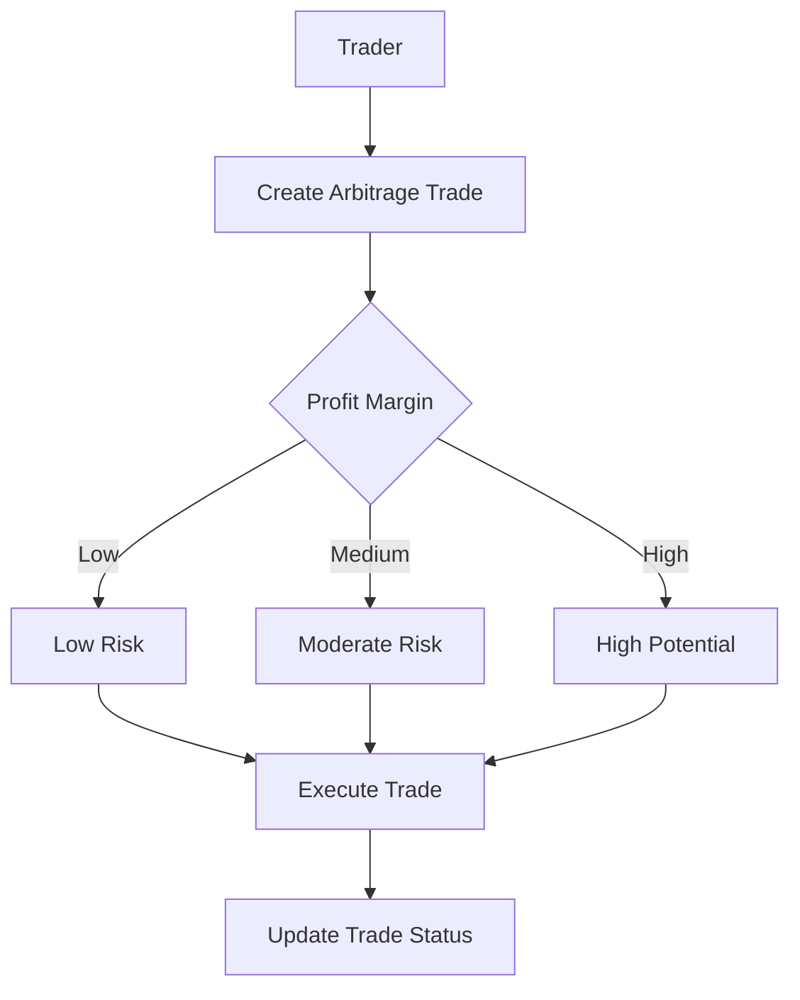

# Decrypt Arbitrage

A decentralized cross-exchange arbitrage tracking and execution platform on the Stacks blockchain. Decrypt Arbitrage enables traders to identify, track, and execute profitable trade opportunities across multiple cryptocurrency exchanges.

## Overview

Decrypt Arbitrage is designed to provide real-time arbitrage opportunity detection and execution tracking. The platform allows users to:

- Identify price discrepancies across exchanges
- Track potential arbitrage opportunities
- Log and validate cross-exchange trades
- Maintain a transparent record of arbitrage activities
- Analyze profit margins systematically

## Architecture

The Decrypt Arbitrage platform is built on a single core smart contract that manages arbitrage trade tracking and execution.



### Core Components

1. **Trade Management**
   - Arbitrage opportunity creation
   - Trade parameter tracking
   - Status management
   - Profit margin categorization

2. **Execution Tracking**
   - Cross-exchange trade logging
   - Verification of trade parameters
   - Transparent trade history

3. **Risk Assessment**
   - Profit margin calculation
   - Trade status monitoring
   - Historical performance tracking

## Contract Documentation

### arbitrage-engine.clar

The main contract handling arbitrage trade management and tracking.

#### Key Features

- Arbitrage trade creation
- Profit margin calculation
- Trade status updates
- User trade history management

#### Access Control

- Trade owners can:
  - Create new trade opportunities
  - Update trade status
  - Track personal trade history
- Public can:
  - View trade details
  - Analyze market opportunities

## Getting Started

### Prerequisites

- Clarinet
- Stacks wallet
- Cryptocurrency exchange accounts

### Installation

1. Clone the repository
2. Install dependencies with Clarinet
3. Deploy contracts to the desired network

### Basic Usage

```clarity
;; Create an arbitrage trade
(contract-call? .arbitrage-engine create-trade
  "Binance"     ;; Source Exchange
  "Kraken"      ;; Target Exchange
  "STX-USDT"    ;; Token Pair
  u100          ;; Buy Price
  u105          ;; Sell Price
  u1000         ;; Trade Volume
)

;; Update trade status
(contract-call? .arbitrage-engine update-trade-status u1 u2)
```

## Function Reference

### Trade Management

```clarity
(create-trade 
  (source-exchange (string-ascii 50))
  (target-exchange (string-ascii 50))
  (token-pair (string-ascii 20))
  (buy-price uint)
  (sell-price uint)
  (trade-volume uint)
)

(update-trade-status 
  (trade-id uint) 
  (status uint)
)
```

### Analytical Functions

```clarity
(calculate-profit-margin 
  (buy-price uint) 
  (sell-price uint) 
  (trade-volume uint)
)
```

## Development

### Testing

1. Run the test suite:
```bash
clarinet test
```

2. Deploy to testnet:
```bash
clarinet deploy --testnet
```

### Local Development

1. Start Clarinet console:
```bash
clarinet console
```

2. Deploy contracts:
```bash
(contract-call? .arbitrage-engine ...)
```

## Security Considerations

### Limitations

- Trade execution relies on off-chain exchange integration
- Profit calculations are basic estimations
- No direct trade execution within the contract

### Best Practices

1. Verify trade parameters thoroughly
2. Consider exchange-specific trading fees
3. Monitor market volatility
4. Implement risk management strategies
5. Use multiple data sources for price verification

### Data Security

- Trade records are immutable on-chain
- Only trade owners can modify their trades
- Transparent logging of all trade activities
- No sensitive exchange credentials stored